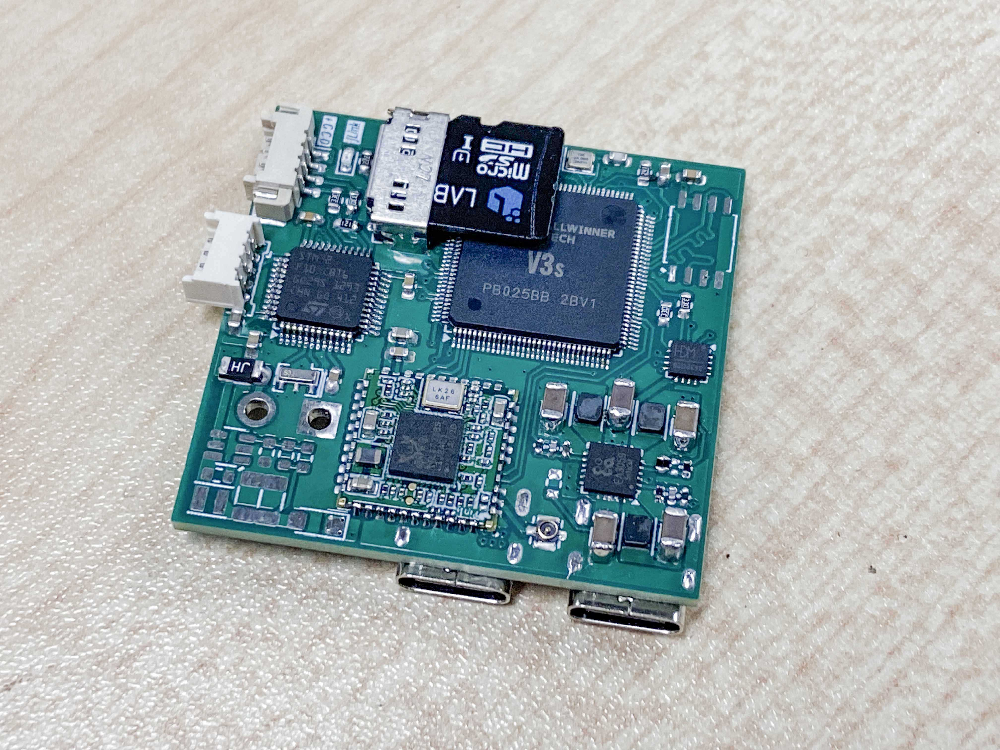
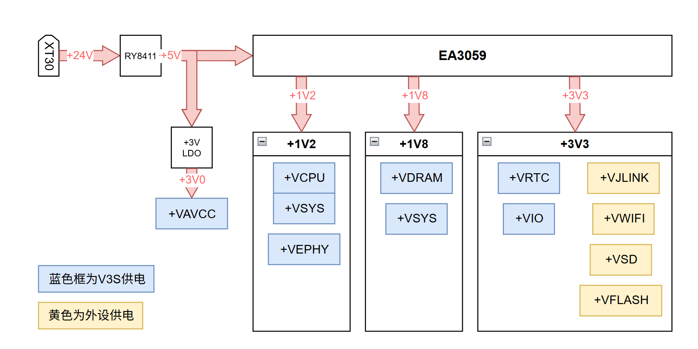
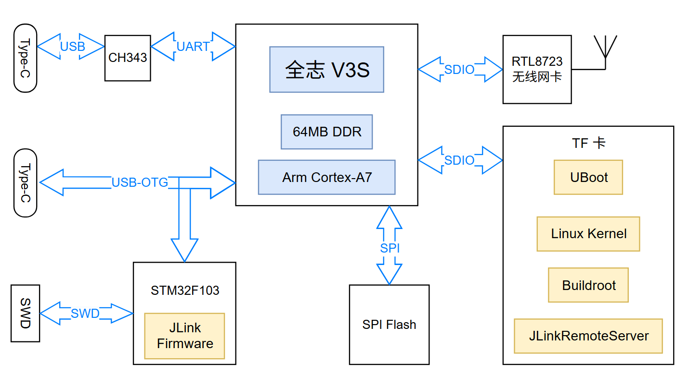
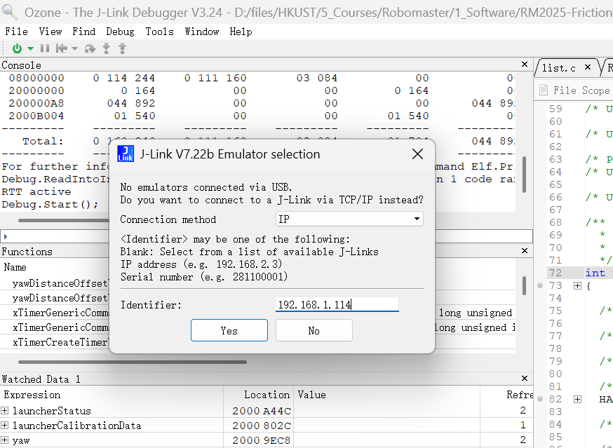

# 基于嵌入式 Linux 的无线 JLink 烧录器
Wireless JLink-OB based on Allwinner V3S
基于全志科技 V3S 的无线 JLink-OB 烧录器. **完美支持 Ozone, Keil, STM32CubeIDE 等开发软件.**
在网络状态良好情况下, Ozone 内最多可以以 1KHZ Graph 3-4 个变量. 或者以 5Hz 刷新率观测约 50 个值.



实现原理: 在 V3S 上运行自编译的 Linux 系统, 并运行 JLinkRemoteServer 共享挂载在 V3S USB 上的 JLink-OB. 板卡通过 RTL8723 SDIO 网卡联网, 处于同一局域网的电脑可通过输入无线烧录器的 IP 地址进行连接.

**主要参数**
|参数||
|:--|:--|
|尺寸|41x39x5mm|
|JLink版本|JLink-OB|
|接口|4线 SWD接口|
|无线连接距离|5-10m|

**硬件选型**
|参数||
|:--|:--|
|JLink MCU|STM32F103CB|
|嵌入式 Linux Soc|全志 V3S|
|网卡型号|RTL8723|
|电源管理芯片|EA3059|

**电源树**
系统电源较为复杂, 共有 +24V, +5V, +3V3, +3V0, +1V8, +1V2 几种不同电压. 主要由 EA3059 (或 EA3059C) 产生. 其中, V3S 内部供电由蓝色标出, 板上其他外设供电由蓝色标出.


**硬件框图**


# 使用方法
> 请注意, 当前版本 SWD 接口的引脚定义与常见 SWD 引脚定义相反. 是笔者的设计失误. 请使用同向 1.25mm 同向线或手动修正线序.

1. 根据下文的固件烧录方法, 烧录 JLink 与 TF 卡固件. 并将 TF 卡插入板子上的 TF 卡座.
2. 电脑打开串口调试助手, 用 Type-C 线连接电脑与 **板子上标有 UART 的 Type-C 座**, 在串口调试助手上打开 CH343 串口. **波特率选择 115200, 数据位 8, 停止位 1, 校验位 None, 无流控**
3. 若硬件一切正常, 固件烧录正确, 将会看到串口调试助手输出以下内容:

```
U-Boot 2017.01-rc2-00057-g32ab1804cd (Sep 30 2024 - 18:54:30 +0800) Allwinner Technology

CPU:   Allwinner V3s (SUN8I 1681)
Model: Lichee Pi Zero
DRAM:  64 MiB

...
Found U-Boot script /boot.scr
reading /boot.scr
...
Starting kernel ...

[    0.000000] Booting Linux on physical CPU 0x0

...
Welcome to ENTERPRIZE buildroot.
```

实际输出可能与给出的示例略有差别, 以打印出 Welcome to ENTERPRIZE buildroot. 为一切正常的标准.
此时的界面为 Linux 命令行登录界面. 账号为 **root**, 密码为 **baoqi**

**Wifi 配置**
首次启动成功后, 请参照如下步骤连接 wifi. 需要注意的是, 路由器需要选择 WPA-EAP/WPA-PSK 加密方式. 其他加密方式需要对应修改 /etc/wpa_supplicant.conf 且笔者实测兼容性较差, 在部分路由器出现认证失败问题无法联网.

1. 编辑 /etc/wpa_supplicant.conf
```conf
ctrl_interface=/var/run/wpa_supplicant
ctrl_interface_group=0
ap_scan=1
network={
    ssid="Your SSID"
    scan_ssid=1
    key_mgmt=WPA-EAP WPA-PSK IEEE8021X NONE
    pairwise=TKIP CCMP
    group=CCMP TKIP WEP104 WEP40
    psk="Your Wifi Password"
    priority=5
}
```

2. 打开 /etc/init.d/wirelessJLinkAutoScript.sh, 并取消相关注释, 最终结果为:
```bash
#!/bin/sh
insmod /lib/modules/r8723bs.ko
ifconfig wlan0 up
wpa_supplicant -B -c /etc/wpa_supplicant.conf -i wlan0
sleep 3s
udhcpc -i wlan0
/root/JLinkARM/JLinkRemoteServerCLExe
```
3. 重启板子, 此时通过串口调试助手观察, 应该会打印出板子对应 IP, 需要并记录此 IP. 同时会显示 Waiting for client connections.. 相关文字, 代表 J-Link Remote Server 已经正常运行.
4. 通过 **交叉 1.25 4Pin 线** 连接无线烧录器 SWD 输出口与目标板.
> 请注意, 当前版本 SWD 接口的引脚定义与常见 SWD 引脚定义相反. 是笔者的设计失误. 请使用同向 1.25mm 同向线或手动修正线序.

5. 以 Ozone 为例, 在同一个局域网内, 输入无线烧录器的 IP 地址即可连接目标板.


> 无线烧录器在车上使用时需要通过 Type-C 或者 XT30 供电. 经测试, 若目标板 SWD 接口有反向供电功能, 不对无线烧录器额外供电也能进行烧录, 但为确保使用稳定性, 仍建议对无线烧录器进行单独供电.


# 固件烧录
目前仅提供 TF 卡烧录相关二进制以及 TF 卡固件编译教程, SPI NOR Flash 镜像仍在调试中. 板子上的 SPI NOR Flash 可以不焊.
> 固件将与编译教程仍在整理中, 将稍后一同开源

**JLink 固件烧录**
参见笔者另一个开源 [【RM2025-地表最小 JLink 开源】香港科技大学 ENTERPRIZE 战队](https://bbs.robomaster.com/article/760967) 中给出的固件以及烧录方法. JLink 固件也放在 ./Firmware/JLink

**TF 卡固件烧录**
TF 卡要求: 容量 >= 512MB. 读写速度无要求.
Linux 下直接用 dd 命令烧录 ./Firmware/V3S/TF.bin

# 固件编译
请参考 [固件编译教程](./Docs/LinuxCompileGuide.md)
其中详细地介绍了如何在 
- [荔枝派 UBoot](https://github.com/Lichee-Pi/u-boot/tree/v3s-current)
- [主线 Linux 内核](https://github.com/torvalds/linux) 
- [主线 Buildroot](https://buildroot.org/downloads/buildroot-2019.08.tar.gz)
的基础上一步步配置并编译出我们所需的 UBoot, 最简 Linux Kernel, 最简 Buildroot.

其中也包含了对全过程工具链, 启动流程, 配置思路, Linux 内核设备树, 关于 JLinkRemoteServer 的研究, RTL8723 无线网卡驱动配置, 固件加载等诸多基础内容的介绍.
凝聚了笔者全过程的踩坑经验, 或许是入门嵌入式 Linux 不错的参考.


# 未来更新
已知的硬件 bug:
- SWD 接口的引脚定义与常见 SWD 引脚定义相反. 是笔者的设计失误. 请使用同向 1.25mm 同向线或手动修正线序.

未来版本中会做如下更新:
- 增加锂电池充放电管理, 使之不再依赖于外部供电
- 修改 JLink 相关电路, 缩小体积
- 减少 V3S 滤波电容, 缩小体积

